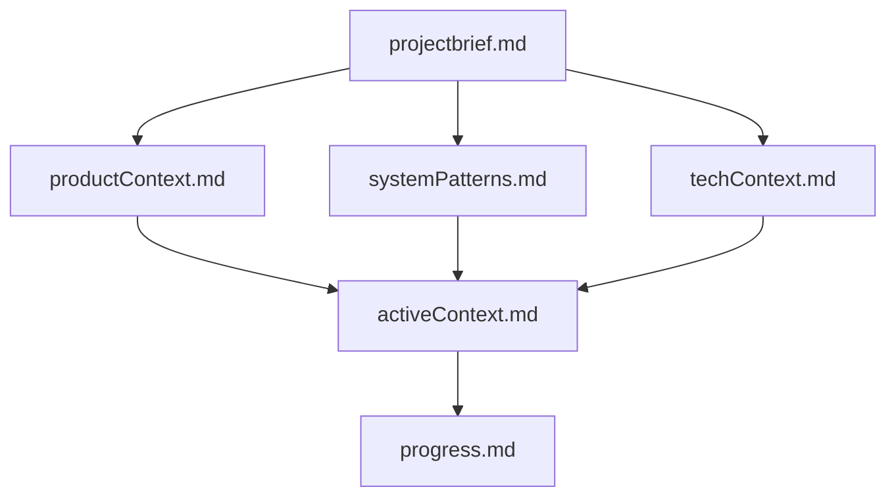

# Memory Bank for VideoCutter

This directory contains the project documentation and context for the VideoCutter project. It serves as the knowledge repository for the project, providing comprehensive information about the project's purpose, architecture, technical decisions, and progress.

## Memory Bank Structure

The Memory Bank consists of several core files that build upon each other in a clear hierarchy:

### Core Files

1. **projectbrief.md**
   - Foundation document that shapes all other files
   - Defines core requirements and goals
   - Source of truth for project scope
   - Overview of functional and technical requirements

2. **productContext.md**
   - Why this project exists
   - Problems it solves
   - How it should work
   - User experience goals and target users

3. **systemPatterns.md**
   - System architecture and component relationships
   - Key technical decisions and their rationale
   - Design patterns used in the project
   - Data and configuration flow

4. **techContext.md**
   - Technologies used and their purposes
   - Development setup requirements
   - Technical constraints and limitations
   - Dependencies and integration points

5. **activeContext.md**
   - Current work focus and priorities
   - Recent changes and developments
   - Next steps and planned tasks
   - Active decisions and considerations

6. **progress.md**
   - What works and what's left to build
   - Current project status and metrics
   - Known issues and challenges
   - Next immediate steps

7. **.clinerules**
   - Project-specific patterns and conventions
   - Critical implementation paths
   - User preferences and workflow
   - Known challenges and workarounds

## Purpose of the Memory Bank

The Memory Bank serves several important purposes:

1. **Knowledge Preservation**
   - Maintains a comprehensive record of project decisions
   - Prevents knowledge loss during team transitions
   - Provides context for future development

2. **Onboarding**
   - Helps new team members understand the project quickly
   - Provides a structured way to learn about the system
   - Reduces dependency on tribal knowledge

3. **Decision Support**
   - Documents the rationale behind technical decisions
   - Provides context for future architectural choices
   - Helps maintain consistency in development approach

4. **Progress Tracking**
   - Records what has been completed and what remains
   - Tracks the evolution of the project over time
   - Provides a basis for planning future work

## Using the Memory Bank

When working with the VideoCutter project, the Memory Bank should be your first stop for understanding the system. Here's how to use it effectively:

1. **Start with projectbrief.md**
   - Understand the core purpose and requirements
   - Get a high-level overview of the project

2. **Explore the context files**
   - Read productContext.md to understand the user perspective
   - Review systemPatterns.md for architectural insights
   - Study techContext.md for technical details

3. **Check current status**
   - Read activeContext.md for current priorities
   - Review progress.md for status and next steps
   - Consult .clinerules for implementation details

4. **Update regularly**
   - Keep the Memory Bank updated as the project evolves
   - Document new decisions and their rationale
   - Update progress and status information

## Maintaining the Memory Bank

The Memory Bank is a living documentation system that should be maintained alongside the code. When making significant changes to the project:

1. Update the relevant Memory Bank files
2. Document new technical decisions and their rationale
3. Keep the progress and status information current
4. Add new patterns and conventions to .clinerules

By maintaining the Memory Bank, you ensure that the project remains well-documented and accessible to current and future team members.
