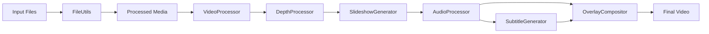
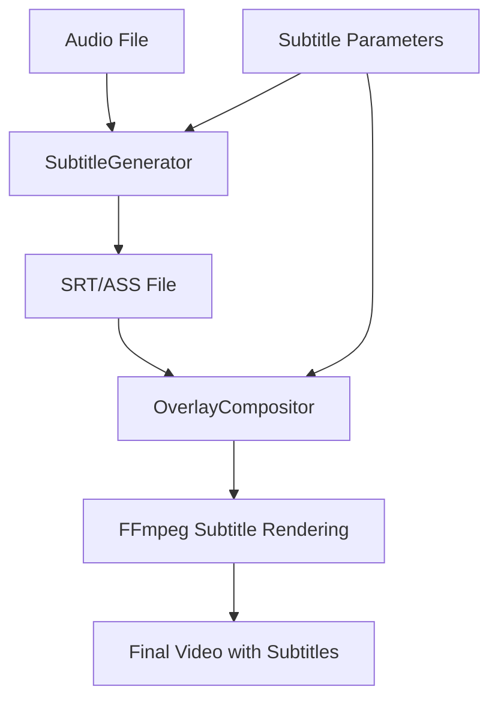

# System Patterns: VideoCutter

## System Architecture

VideoCutter follows a modular architecture with a clear separation of concerns. The system is organized into distinct components that handle specific aspects of the video processing pipeline. A significant refactoring is underway, transitioning from older monolithic scripts to a new, modular `videocutter` package, with `videocutter/main.py` serving as the central orchestrator.

```mermaid
graph TD
    GUI[GUI Interface (gui.py)] --> Main[videocutter/main.py]
    Main --> Config[videocutter/config_manager.py]
    Main --> FileUtils[videocutter/utils/file_utils.py]
    Main --> VideoProcessor[videocutter/processing/video_processor.py]
    Main --> DepthProcessor[videocutter/processing/depth_processor.py]
    Main --> SlideshowGenerator[videocutter/processing/slideshow_generator.py]
    Main --> AudioProcessor[videocutter/processing/audio_processor.py]
    Main --> SubtitleGenerator[videocutter/processing/subtitle_generator.py]
    Main --> OverlayCompositor[videocutter/processing/overlay_compositor.py]
    Main --> FinalVideo[Final Video]

    Config --> GUI
    FileUtils --> VideoProcessor
    FileUtils --> SlideshowGenerator
    FileUtils --> AudioProcessor
    FileUtils --> SubtitleGenerator
    FileUtils --> OverlayCompositor
    FontUtils[videocutter/utils/font_utils.py] --> SubtitleGenerator
    FontUtils --> OverlayCompositor
    GUIConfigManager[videocutter/utils/gui_config_manager.py] --> GUI
    TitleSettingsFrame[videocutter/gui/title_settings_frame.py] --> GUI
    GUIUtils[videocutter/gui/gui_utils.py] --> GUI
```

### Component Responsibilities

1.  **GUI Interface (`gui.py`)**:
    - Provides user interface for configuration.
    - Manages configuration presets via `videocutter/utils/gui_config_manager.py`.
    - Initiates the processing pipeline by calling `videocutter/main.py`.

2.  **Main Orchestrator (`videocutter/main.py`)**:
    - Central control for the entire video processing workflow.
    - Coordinates calls to various processing modules.
    - Manages temporary files and cleanup.

3.  **Configuration Manager (`videocutter/config_manager.py`)**:
    - Handles hierarchical loading and merging of configuration settings.
    - Provides a unified configuration object (`DotMap`) to other modules.

4.  **File Utilities (`videocutter/utils/file_utils.py`)**:
    - Manages file and directory operations (setup, backup, finding files, organizing).

5.  **Video Processor (`videocutter/processing/video_processor.py`)**:
    - Processes input videos and images (splitting, conversion, resizing, formatting).

6.  **Depth Processor (`videocutter/processing/depth_processor.py`)**:
    - Applies 3D parallax effects to static images using DepthFlow.

7.  **Slideshow Generator (`videocutter/processing/slideshow_generator.py`)**:
    - Creates base video slideshows from processed media.
    - Adds transitions and watermarks.

8.  **Audio Processor (`videocutter/processing/audio_processor.py`)**:
    - Processes and mixes audio (soundtrack, voiceover, transitions).
    - Synchronizes audio with video.

9.  **Subtitle Generator (`videocutter/processing/subtitle_generator.py`)**:
    - Transcribes audio and generates subtitle files (SRT/ASS).
    - Handles subtitle styling.

10. **Overlay Compositor (`videocutter/processing/overlay_compositor.py`)**:
    - Applies final visual overlays (subscribe, effects, title text/video).
    - Renders subtitles onto the video.

11. **Font Utilities (`videocutter/utils/font_utils.py`)**:
    - Extracts font names from font files for accurate rendering.

12. **GUI Config Manager (`videocutter/utils/gui_config_manager.py`)**:
    - Centralizes default GUI values.
    - Manages GUI-related configuration file interactions (load, save, delete).

13. **Title Settings Frame (`videocutter/gui/title_settings_frame.py`)**:
    - Encapsulates GUI controls specifically for text titles and title video overlays.

14. **GUI Utilities (`videocutter/gui/gui_utils.py`)**:
    - Provides utility functions for GUI elements, such as slider-entry synchronization and subtitle preview rendering.

## Key Technical Decisions

### 1. Modular Python Package Architecture

**Decision**: Transition from separate Python scripts to a unified, modular Python package (`videocutter`).

**Rationale**:
- Improved maintainability and readability through clear module boundaries.
- Enhanced testability by allowing independent unit testing of components.
- Better scalability for adding new features or modifying existing ones.
- Reduced technical debt by untangling monolithic script logic.
- Facilitates better code organization and reusability.

### 2. Centralized Orchestration

**Decision**: Implement `videocutter/main.py` as the primary orchestrator, coordinating calls to specialized modules.

**Rationale**:
- Provides a single entry point for the video processing pipeline.
- Simplifies the overall workflow management.
- Decouples the GUI from direct calls to individual processing steps.

### 3. FFmpeg for Video Processing

**Decision**: Continue using FFmpeg as the core video processing engine.

**Rationale**:
- Industry-standard tool with comprehensive capabilities.
- Excellent performance and reliability.
- Extensive format support.
- Well-documented command structure.

### 4. Configuration Management with `DotMap`

**Decision**: Utilize `videocutter/config_manager.py` to load and merge configurations into a `DotMap` object.

**Rationale**:
- Provides flexible and convenient access to configuration parameters using dot notation.
- Centralizes configuration logic, making it easier to manage defaults, project-specific settings, and runtime overrides.

### 5. Date-Time Based Organization

**Decision**: Organize output in date-time stamped folders.

**Rationale**:
- Prevents file conflicts.
- Creates natural versioning.
- Simplifies tracking of output history.
- Enables batch processing of multiple runs.

### 6. Source Backup

**Decision**: Automatically backup original files.

**Rationale**:
- Prevents data loss.
- Enables reprocessing if needed.
- Maintains archive of original content.
- Supports audit trail of modifications.

### 7. ASS Subtitle Format for Advanced Styling

**Decision**: Use Advanced SubStation Alpha (ASS) format for subtitle styling.

**Rationale**:
- Provides rich styling options (font, color, position, effects).
- Supports shadow and outline effects.
- Allows precise control over subtitle appearance.
- Compatible with FFmpeg's subtitle rendering.

## Design Patterns

### 1. Pipeline Pattern

The overall system follows a pipeline pattern, where each modular component processes data and passes it to the next component. This enables a clear flow of data and processing steps.

### 2. Facade Pattern

`videocutter/main.py` acts as a facade, providing a simplified interface to the complex underlying video processing modules.

### 3. Strategy Pattern

Different processing modules (e.g., `video_processor`, `audio_processor`) can be seen as implementing different strategies for their respective domains, which are then invoked by the main orchestrator.

### 4. Configuration Object Pattern

The `DotMap` configuration object passed between modules centralizes and manages all parameters, acting as a single source of truth for settings.

## Component Relationships

### Data Flow



### Configuration Flow

```mermaid
graph TD
    GlobalConfig[Global Config (default_config.json)] --> ConfigManager
    ProjectConfig[Project Config (_project_config.json)] --> ConfigManager
    RuntimeSettings[Runtime Settings (GUI)] --> ConfigManager
    ConfigManager --> UnifiedConfig[Unified Config (DotMap)]
    UnifiedConfig --> Main
    UnifiedConfig --> VideoProcessor
    UnifiedConfig --> DepthProcessor
    UnifiedConfig --> SlideshowGenerator
    UnifiedConfig --> AudioProcessor
    UnifiedConfig --> SubtitleGenerator
    UnifiedConfig --> OverlayCompositor
    UnifiedConfig --> GUIConfigManager
    UnifiedConfig --> TitleSettingsFrame
```

## Subtitle Processing Architecture



### Subtitle Styling Components

1.  **Font Selection**: Custom font loading from `fonts/` directory via `font_utils.py`.
2.  **Color Management**: RGB to BGR conversion for ASS format, handled in `subtitle_generator.py` and `overlay_compositor.py`.
3.  **Shadow Effects**: Configurable shadow with opacity control.
4.  **Outline Effects**: Variable thickness outline rendering.
5.  **Positioning**: 9-point positioning system (1-9 ASS alignment).

## Error Handling

The system implements a progressive error handling approach:

1.  **Input Validation**: GUI validates user inputs before processing.
2.  **Process Monitoring**: Each module monitors subprocess execution (e.g., FFmpeg calls).
3.  **Error Logging**: Errors are logged to the console.
4.  **Graceful Degradation**: Pipeline continues even if some steps fail (where applicable).
5.  **File Preservation**: Original files are preserved regardless of errors.

## Performance Considerations

1.  **Parallel Processing**: Some components (like DepthFlow) use parallel processing for performance.
2.  **Resource Management**: Video processing is memory and CPU intensive.
3.  **File I/O Optimization**: Minimizes unnecessary file operations.
4.  **Format Efficiency**: Uses efficient video codecs and formats.

## Future Architecture Considerations

1.  **Queue System**: Potential for implementing a job queue for batch processing.
2.  **Plugin Architecture**: Framework for extending with additional effects or processors.
3.  **Web Interface**: Possibility of web-based control interface.
4.  **Distributed Processing**: Potential for distributing processing across multiple machines.
