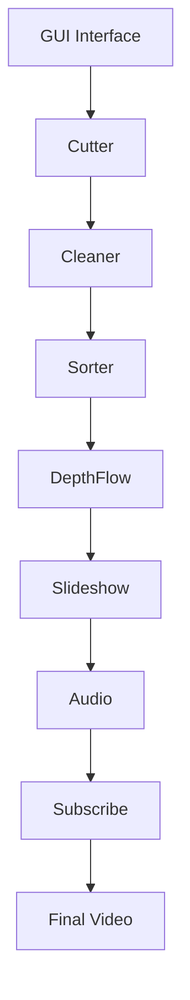
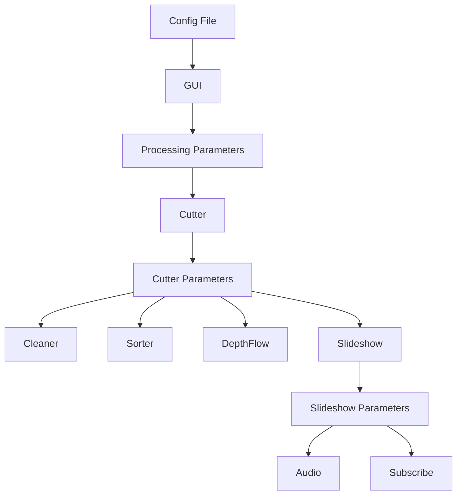
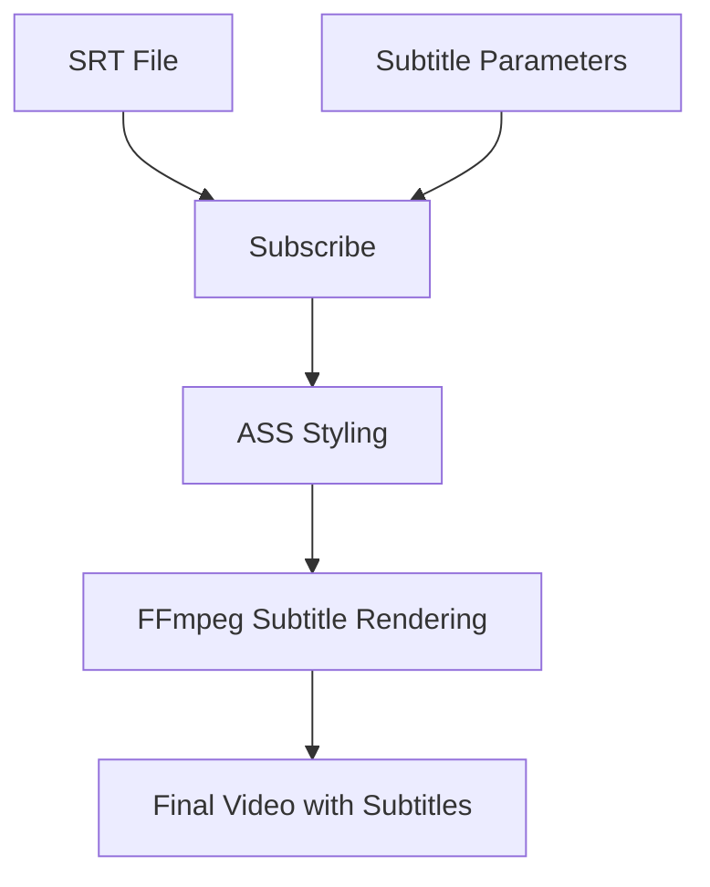

# System Patterns: VideoCutter

## System Architecture

VideoCutter follows a modular architecture with a clear separation of concerns. The system is organized into distinct components that handle specific aspects of the video processing pipeline. A significant refactoring is planned to further enhance this modularity, particularly by evolving the orchestration currently managed by `cutter.py` into a more centralized main controller and breaking down core scripts into more specialized modules.

### Component Responsibilities

1. **GUI Interface (`gui.py`)**: 
   - Provides user interface for configuration
   - Manages configuration presets
   - Initiates the processing pipeline

2. **Cutter (`cutter.py`)**: 
   - Processes input videos and images
   - Splits videos into segments
   - Handles image resizing and formatting
   - Orchestrates the overall workflow

3. **Cleaner (`cleaner.py`)**: 
   - Removes videos shorter than specified duration
   - Ensures quality control of segments

4. **Sorter (`sorter.py`)**: 
   - Organizes files into date-time folders
   - Renames files for consistent processing

5. **DepthFlow (`depth.py`)**: 
   - Applies 3D parallax effects to images
   - Creates depth-enhanced video segments

6. **Slideshow (`slideshow.py`)**: 
   - Creates slideshow from processed media
   - Adds transitions and effects
   - Incorporates watermarks

7. **Audio (`audio.py`)**: 
   - Processes soundtrack and voiceover
   - Applies audio mixing and effects
   - Synchronizes audio with video

8. **Subscribe (`subscribe.py`)**: 
   - Adds branding and subscription overlays
   - Adds subtitle rendering to videos
   - Finalizes the video for distribution

## Key Technical Decisions

### 1. Modular Script Architecture

**Decision**: Implement functionality in separate Python scripts rather than a monolithic application.

**Rationale**:
- Easier maintenance and debugging
- Allows for independent development of features
- Enables selective execution of pipeline stages
- Simplifies future extensions

### 2. Command-Line Interface Between Components

**Decision**: Use command-line arguments for inter-script communication.

**Rationale**:
- Enables script independence
- Allows for manual execution of individual steps
- Simplifies debugging and testing
- Provides clear documentation of parameters

### 3. FFmpeg for Video Processing

**Decision**: Use FFmpeg as the core video processing engine.

**Rationale**:
- Industry-standard tool with comprehensive capabilities
- Excellent performance and reliability
- Extensive format support
- Well-documented command structure

### 4. Configuration Presets

**Decision**: Implement JSON-based configuration presets.

**Rationale**:
- Enables quick setup for recurring tasks
- Reduces user error
- Provides template system for different output styles
- Simplifies complex parameter combinations

### 5. Date-Time Based Organization

**Decision**: Organize output in date-time stamped folders.

**Rationale**:
- Prevents file conflicts
- Creates natural versioning
- Simplifies tracking of output history
- Enables batch processing of multiple runs

### 6. Source Backup

**Decision**: Automatically backup original files.

**Rationale**:
- Prevents data loss
- Enables reprocessing if needed
- Maintains archive of original content
- Supports audit trail of modifications

### 7. ASS Subtitle Format for Advanced Styling

**Decision**: Use Advanced SubStation Alpha (ASS) format for subtitle styling.

**Rationale**:
- Provides rich styling options (font, color, position, effects)
- Supports shadow and outline effects
- Allows precise control over subtitle appearance
- Compatible with FFmpeg's subtitle rendering

## Design Patterns

### 1. Pipeline Pattern

The overall system follows a pipeline pattern, where each component processes data and passes it to the next component. This enables a clear flow of data and processing steps.

### 2. Command Pattern

Each script acts as a command that can be executed independently with specific parameters. The GUI acts as the invoker that configures and executes these commands.

### 3. Factory Pattern

Configuration presets act as factories that create specific configurations for the processing pipeline.

### 4. Template Method Pattern

The processing pipeline defines a template of steps that are executed in sequence, with specific implementations for each step.

## Component Relationships

### Data Flow

### Configuration Flow

## Subtitle Processing Architecture

### Subtitle Styling Components

1. **Font Selection**: Custom font loading from fonts/ directory
2. **Color Management**: RGB to BGR conversion for ASS format
3. **Shadow Effects**: Configurable shadow with opacity control
4. **Outline Effects**: Variable thickness outline rendering
5. **Positioning**: 9-point positioning system (1-9 ASS alignment)

## Error Handling

The system implements a progressive error handling approach:

1. **Input Validation**: GUI validates user inputs before processing
2. **Process Monitoring**: Each script monitors subprocess execution
3. **Error Logging**: Errors are logged to the console
4. **Graceful Degradation**: Pipeline continues even if some steps fail
5. **File Preservation**: Original files are preserved regardless of errors

## Performance Considerations

1. **Parallel Processing**: Some components (like DepthFlow) use parallel processing for performance
2. **Resource Management**: Video processing is memory and CPU intensive
3. **File I/O Optimization**: Minimizes unnecessary file operations
4. **Format Efficiency**: Uses efficient video codecs and formats

## Future Architecture Considerations

1. **Queue System**: Potential for implementing a job queue for batch processing
2. **Plugin Architecture**: Framework for extending with additional effects or processors
3. **Web Interface**: Possibility of web-based control interface
4. **Distributed Processing**: Potential for distributing processing across multiple machines

5. **Core Script Refactoring**:
   - **Goal**: To improve maintainability, testability, and scalability by refactoring `cutter.py` and potentially other scripts like `sorter.py`, `cleaner.py`, `slideshow.py`, `subscribe.py`, and `depth.py`.
   - **Approach**: Identify and extract cohesive functionalities into separate, well-defined modules. Introduce a dedicated main controller script (e.g., `main.py` or a refactored `cutter.py`) to manage the overall workflow and coordinate these modules.
   - **Impact**: This will lead to a more granular and robust architecture, making future development and enhancements easier.
