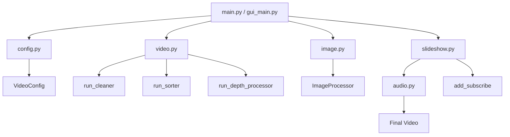
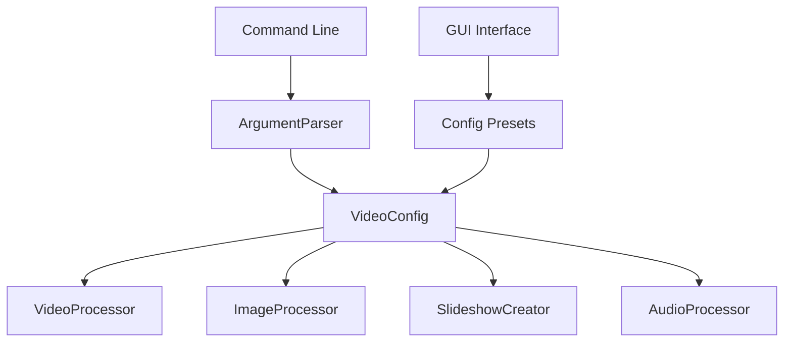

# System Patterns: VideoCutter

## System Architecture

VideoCutter follows a modular architecture with a clear separation of concerns. The system is organized into a package structure with specialized modules that handle specific aspects of the video processing pipeline:



### Component Responsibilities

1. **Entry Points**:
   - `main.py`: Command-line interface entry point
   - `gui_main.py`: Graphical user interface entry point

2. **Configuration (`config.py`)**:
   - `VideoConfig` class for managing all settings
   - Command-line argument parsing
   - Default values and derived settings

3. **Video Processing (`video.py`)**:
   - `VideoProcessor` class for processing videos
   - Video splitting into segments
   - Running cleaner, sorter, and depth processor
   - Managing file organization

4. **Image Processing (`image.py`)**:
   - `ImageProcessor` class for processing images
   - Image resizing and formatting
   - Applying effects and filters
   - Supporting different orientations

5. **Slideshow Creation (`slideshow.py`)**:
   - `SlideshowCreator` class for creating slideshows
   - Combining videos and images
   - Adding transitions and effects
   - Integrating with audio and overlays

6. **Audio Processing (`audio.py`)**:
   - `AudioProcessor` class for processing audio
   - Mixing soundtrack and voiceover
   - Adding transition sounds
   - Synchronizing with video

7. **Utilities (`utils.py`)**:
   - Common utility functions
   - File operations
   - Video analysis
   - Directory management

8. **GUI Interface (`gui.py`)**:
   - `VideoCutterGUI` class for the user interface
   - Configuration management
   - User input handling
   - Process initiation

## Key Technical Decisions

### 1. Modular Package Structure

**Decision**: Implement the application as a Python package with specialized modules.

**Rationale**:
- Improves code organization and maintainability
- Enables better separation of concerns
- Facilitates unit testing and code reuse
- Provides a clearer mental model of the system

### 2. Configuration Management

**Decision**: Implement a centralized configuration class with command-line and GUI interfaces.

**Rationale**:
- Provides a single source of truth for settings
- Simplifies parameter management
- Enables easy switching between configurations
- Improves user experience with presets

### 3. Class-Based Design

**Decision**: Use classes to encapsulate related functionality and state.

**Rationale**:
- Organizes related functionality together
- Manages state more effectively
- Provides clear interfaces between components
- Follows object-oriented design principles

### 4. Comprehensive Documentation

**Decision**: Add detailed docstrings, type hints, and README files throughout the codebase.

**Rationale**:
- Improves code understanding for new developers
- Serves as a reference for existing developers
- Facilitates maintenance and future development
- Provides examples and usage patterns

### 5. Testing Framework

**Decision**: Implement unit tests with pytest and coverage reporting.

**Rationale**:
- Ensures code correctness
- Facilitates refactoring and changes
- Documents expected behavior
- Identifies untested code paths

## Design Patterns

### 1. Factory Pattern

The `VideoConfig` class acts as a factory that creates configuration objects from command-line arguments or GUI inputs:

```python
# Factory method in config.py
def parse_arguments() -> VideoConfig:
    parser = argparse.ArgumentParser(...)
    # Parse arguments
    args = parser.parse_args()
    # Create and return the config object
    config = VideoConfig(
        segment_duration=args.segment_duration,
        # Other parameters...
    )
    return config
```

### 2. Strategy Pattern

The processing pipeline uses different strategies based on configuration options:

```python
# Strategy selection in video.py
def run_depth_processor(self):
    if self.config.depthflow == '1':
        # Use DepthFlow strategy
        self._run_depth_processor_with_depthflow()
    else:
        # Use standard strategy
        self._run_standard_processor()
```

### 3. Template Method Pattern

The processing pipeline defines a template of steps that are executed in sequence:

```python
# Template method in main.py
def main():
    # Parse configuration
    config = parse_arguments()
    
    # Initialize processors
    video_processor = VideoProcessor(config)
    image_processor = ImageProcessor(config)
    slideshow_creator = SlideshowCreator(config)
    
    # Execute processing steps
    video_processor.process_videos()
    image_processor.process_images(...)
    video_processor.run_cleaner()
    video_processor.run_sorter()
    video_processor.run_depth_processor()
    slideshow_creator.process_all_folders()
```

### 4. Facade Pattern

The main entry points (`main.py` and `gui_main.py`) provide a simplified interface to the complex processing pipeline:

```python
# Facade in gui_main.py
def main():
    # Initialize the GUI
    gui = VideoCutterGUI()
    
    # Start the main event loop
    gui.run()
```

## Component Relationships

### Data Flow

```mermaid
graph LR
    Input[Input Files] --> VideoProcessor
    VideoProcessor --> ProcessedVideos[Processed Videos]
    Input --> ImageProcessor
    ImageProcessor --> ProcessedImages[Processed Images]
    ProcessedVideos --> Cleaner
    Cleaner --> CleanedVideos[Cleaned Videos]
    CleanedVideos --> Sorter
    ProcessedImages --> Sorter
    Sorter --> OrganizedMedia[Organized Media]
    OrganizedMedia --> DepthProcessor
    DepthProcessor --> EnhancedMedia[Enhanced Media]
    EnhancedMedia --> SlideshowCreator
    SlideshowCreator --> RawSlideshow[Raw Slideshow]
    RawSlideshow --> AudioProcessor
    AudioProcessor --> AudioSlideshow[Audio Slideshow]
    AudioSlideshow --> SubscribeOverlay
    SubscribeOverlay --> FinalVideo[Final Video]
```



### Configuration Flow



## Error Handling

The system implements a progressive error handling approach:

1. **Input Validation**:
   - Configuration validation in `VideoConfig` class
   - File existence checks before processing
   - Format validation for videos and images

2. **Process Monitoring**:
   - Subprocess execution monitoring
   - Return code checking
   - Output capturing for debugging

3. **Exception Handling**:
   - Try-except blocks around critical operations
   - Specific exception types for different errors
   - Descriptive error messages

4. **Graceful Degradation**:
   - Continue processing even if some files fail
   - Skip invalid files rather than aborting
   - Provide feedback about skipped files

5. **File Preservation**:
   - Backup original files before processing
   - Use temporary files for intermediate steps
   - Ensure output directories exist

## Performance Considerations

1. **Parallel Processing**:
   - DepthFlow uses parallel processing for performance
   - Configurable number of workers based on system resources
   - Environment variable control: `WORKERS`

2. **Resource Management**:
   - Video processing is memory and CPU intensive
   - Temporary files cleaned up after processing
   - Efficient file operations to minimize I/O

3. **Format Efficiency**:
   - H.264 codec for video compression
   - AAC codec for audio compression
   - Optimized settings for quality vs. size

4. **Processing Optimization**:
   - Efficient FFmpeg command construction
   - Minimal file operations
   - Reuse of common operations

## Future Architecture Considerations

1. **Plugin Architecture**:
   - Framework for extending with additional effects or processors
   - Standard interface for plugins
   - Dynamic discovery and loading

2. **Web Interface**:
   - Web-based control interface
   - RESTful API for remote control
   - Progress monitoring and notification

3. **Distributed Processing**:
   - Distributing processing across multiple machines
   - Job queue for managing workload
   - Worker nodes for parallel processing

4. **Cloud Integration**:
   - Cloud storage for input and output
   - Cloud-based processing options
   - Direct publishing to social media
